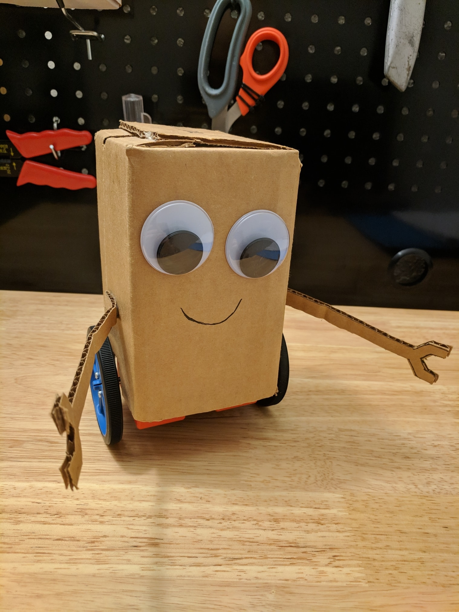
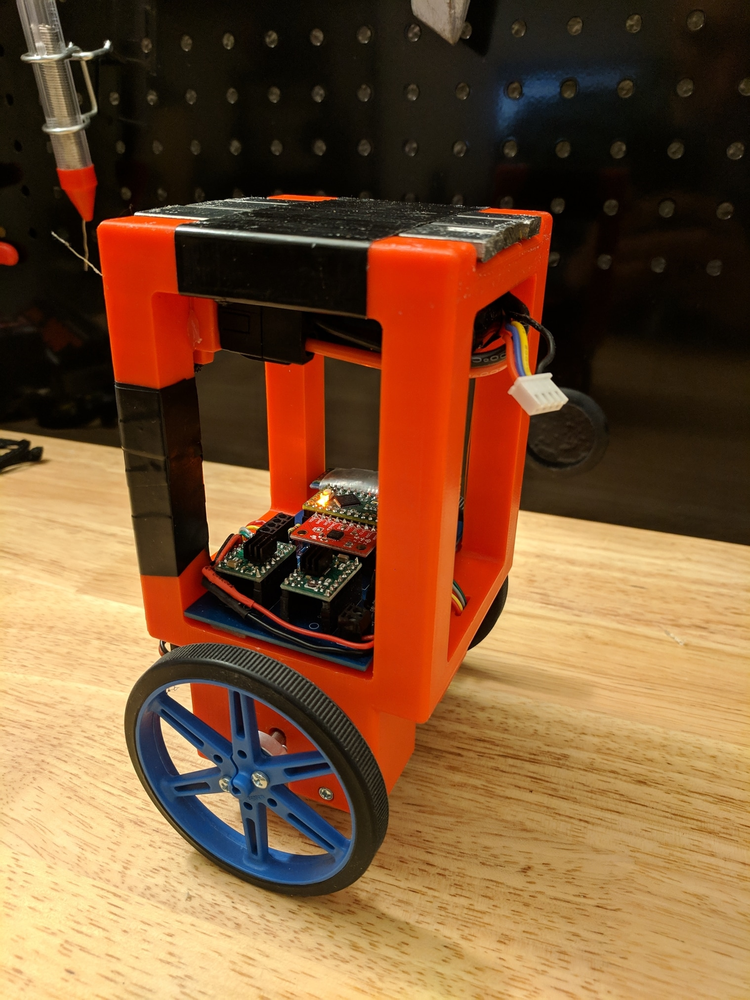
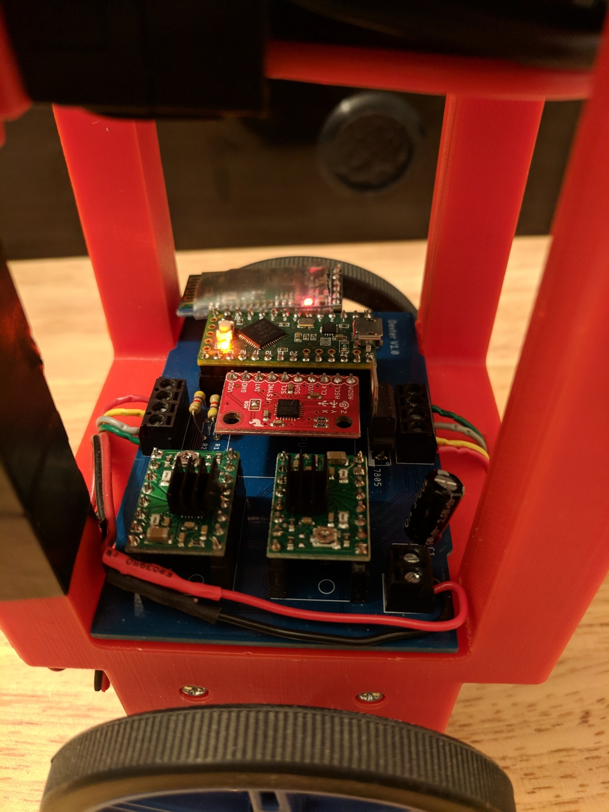

# Dexter #
Dexter is an adorable two-wheeled robot controlled by an Android app.

## Hardware ##
* Teensy LC Microncontroller [pjrc](https://www.pjrc.com/teensy/teensyLC.html) 
* MPU-6050 IMU [sparkfun](https://www.sparkfun.com/products/11028)
* 2 A4988 Stepper Drivers [pololu](https://www.pololu.com/product/1182)
* HC-05 Bluetooth Module [amazon](https://www.amazon.com/LeaningTech-HC-05-Module-Pass-Through-Communication/dp/B00INWZRNC)
* 2 Stepper Motors [sparkfun](https://www.sparkfun.com/products/9238) 
* 1300 mAh 3S LiPo Battery

The Teensy LC was a good fit for this project because it has 3 hardware serial lines and multiple timers. 
Dexter uses serial to communicate with the HC-05, and the stepper drivers each require a 16 bit timer to work. 

I don't know the exact model number of the motors I used, but they look pretty standard.

I also added some iron weight on top for added stability.

## Frame and PCB ##

 

I designed the 3D-printed frame using Fusion 360, and designed the custom circuit board in Eagle.

## IMU ##
The MPU-6050 IMU includes a gyroscope and accelerometer, and I combined the measured angle from the accelerometer with the rate from the gyro using a basic collaborative filter. A more advanced Kalman filter would be more accurate, but IMU accuracy was not a limiting factor.

`pitch = 0.99 * (pitch + G_y * dt) - 0.01 * atan2(A_x, A_z)`

The rate from the gyroscope reacts quickly to changes in pitch, and the small correction from the accelerometer prevents drifting over time. The accelerometer is very sensitive to quick movements, so it can't be used by itself.

IMU code was taken from the Arduino example ([link](https://playground.arduino.cc/Main/MPU-6050#sketch))

## Motor Drivers ##
The Teensy controls the A4988 motor drivers by sending pulses; each time the Teensy sends a pulse, the driver takes one step. To send pulses, I used the `TimerOne` and `TimerThree` libraries. These libraries trigger a callback funciton at a specified frequency, and in the callback function I send a pulse by toggling the trigger pin on and off.

Both motors were operated in 1/8 microstepping mode for smoother motion.

## PID Control ##
Dexter uses two cascading controllers. First, the ground speed PI controller calculates the desired angle based on the speed error. Second, the angle PD controller calculates the output steps per second to reach the desired angle. Since these motors don't have encoders, the only way to measure the current ground speed is to use the steps per second value calculated by the angle controller.

To tune Dexter, I added a basic [Twiddle](https://www.youtube.com/watch?v=2uQ2BSzDvXs) function. If Dexter receives the letter "t" over bluetooth, he will drive forward for a few seconds, stop, drive back, and report the total error during the trip. All of the PID constants can be changed over bluetooth and optimized to reduce the twiddle error.

## Android App ##
The included Android app steers Dexter by reading the accelerometer. In order to tune the PID constants, I used a bluetooth terminal app ([Play Store Link](https://play.google.com/store/apps/details?id=com.giumig.apps.bluetoothserialmonitor&hl=en_US))

## Sources ##
[jjrobots B-robot EVO 2](https://github.com/jjrobots/B-ROBOT_EVO2/tree/master/Arduino/BROBOT_EVO2)

[Brokking YABR](http://www.brokking.net/yabr_main.html)
